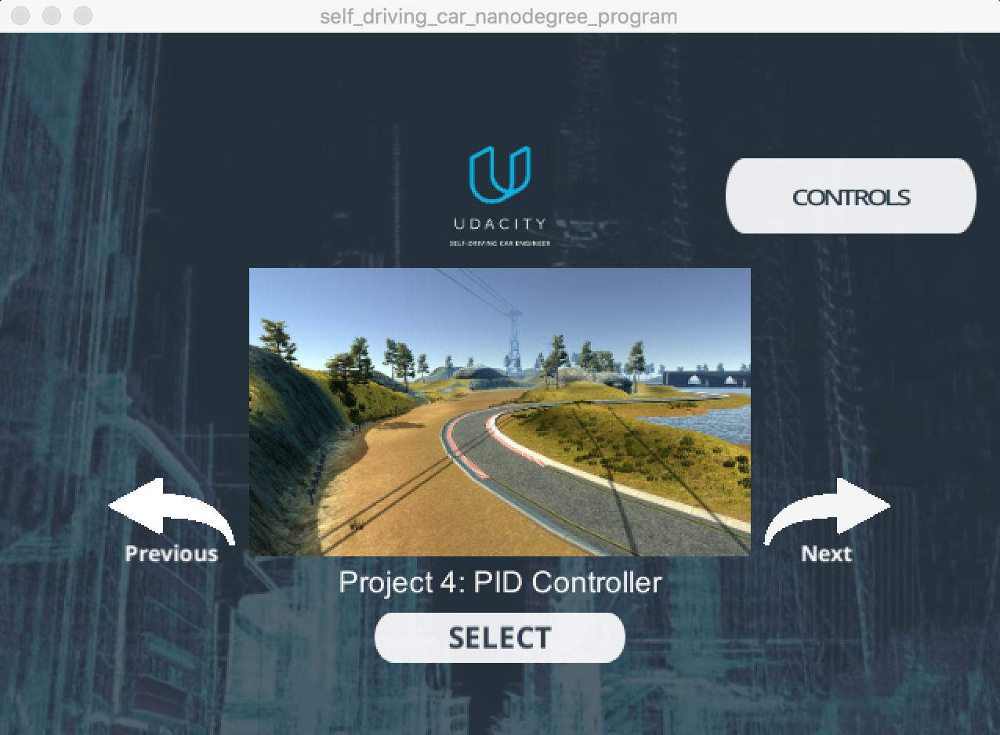
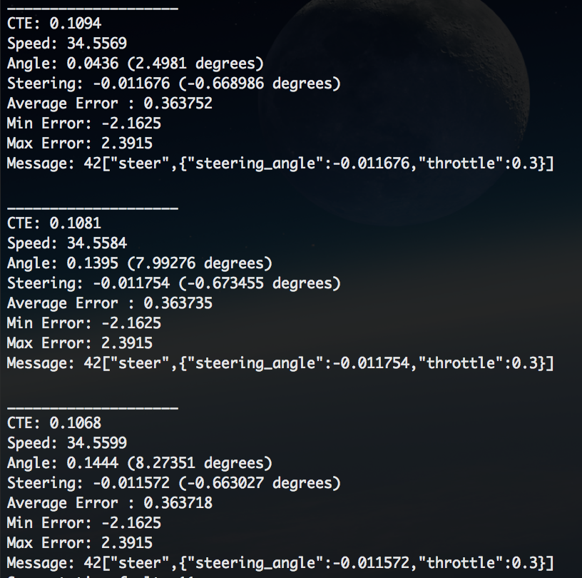

# Self-Driving Car Project 9. PID Control

## Overview

This project implements a [PID controller](https://en.wikipedia.org/wiki/PID_controller) to control a car in the car simulator([which can be downloaded here](https://github.com/udacity/self-driving-car-sim/releases)). The simulator sends cross-track error, speed and angle to the PID controller using [WebSocket](https://en.wikipedia.org/wiki/WebSocket) and it receives the steering angle ([-1, 1] normalized) and the throttle to drive the car. The PID uses the [uWebSockets](https://github.com/uNetworking/uWebSockets) WebSocket implementation.

## Dependencies

* cmake >= 3.5
 * All OSes: [click here for installation instructions](https://cmake.org/install/)
* make >= 4.1(mac, linux), 3.81(Windows)
  * Linux: make is installed by default on most Linux distros
  * Mac: [install Xcode command line tools to get make](https://developer.apple.com/xcode/features/)
  * Windows: [Click here for installation instructions](http://gnuwin32.sourceforge.net/packages/make.htm)
* gcc/g++ >= 5.4
  * Linux: gcc / g++ is installed by default on most Linux distros
  * Mac: same deal as make - [install Xcode command line tools]((https://developer.apple.com/xcode/features/)
  * Windows: recommend using [MinGW](http://www.mingw.org/)
* [uWebSockets](https://github.com/uWebSockets/uWebSockets)
  * Run either `./install-mac.sh` or `./install-ubuntu.sh`.
  * If we install from source, checkout to commit `e94b6e1`, i.e.
    ```
    git clone https://github.com/uWebSockets/uWebSockets 
    cd uWebSockets
    git checkout e94b6e1
    ```
    Some function signatures have changed in v0.14.x. See [this PR](https://github.com/udacity/CarND-MPC-Project/pull/3) for more details.
* Simulator. We can download these from the [project intro page](https://github.com/udacity/self-driving-car-sim/releases) in the classroom.

There's an experimental patch for windows in this [PR](https://github.com/udacity/CarND-PID-Control-Project/pull/3).

## Basic Build Instructions

1. Clone this repo
2. Make a build directory: `mkdir build && cd build`
3. Compile: `cmake .. && make`
4. Run it: `./pid`

Tips for setting up our environment can be found [here](https://classroom.udacity.com/nanodegrees/nd013/parts/40f38239-66b6-46ec-ae68-03afd8a601c8/modules/0949fca6-b379-42af-a919-ee50aa304e6a/lessons/f758c44c-5e40-4e01-93b5-1a82aa4e044f/concepts/23d376c7-0195-4276-bdf0-e02f1f3c665d)

## Editor Settings

Here in this project, we use the following settings:
* Indent using spaces
* Set tab width to 4 spaces (keeps the matrices in source code aligned)

## Coding Style

Please (do our best to) stick to [Google's C++ style guide](https://google.github.io/styleguide/cppguide.html).

## Test the PID Controller

### Start the Simulator

Here is the start view of the simulator:



### Start the PID Controller

Run the `./pid`, and here is the output:
```
Listening to port 4567
Connected!!!
```

which means the our PID controller has connected to the simulator successfully.

### PID Controller with Final HyperParameters

The PID controller built with the final hyperparameters can successfully drive more than one lap around the track. And, this is a short video of the driving: [./README-videos/PID-with-final-parameters.mov](./README-videos/PID-with-final-parameters.mov).

And, here is the execution log of the PID controller in the terminal:


### PID Controller with Only the Proportional Component

The proportional component tries to steer the car toward the center line (against the cross-track error). If only the proportional component is used, the car overshoots the central line very easily and go out of the road very quickly. Here is an example video recording on only this component is used: [./README-videos/PID-with-only-proportional.mov](./README-videos/PID-with-only-proportional.mov).

### PID Controller with Only the Integral Component

The integral component tries to eliminate a possible bias on the controlled system that could prevent the error from being eliminated. If only the proportional component is used, it makes the car to go in circles. In the case of the simulator, no bias is present. Here is an example video recording on only this component is used: [./README-videos/PID-with-only-integral.mov](./README-videos/PID-with-only-integral.mov).

### PID Controller with Only the Differential Component

The differential component helps to counteract the proportional trend to overshoot the center line by smoothing the approach to it. Here is an example video recording on only this component is used: [./README-videos/PID-with-only-differential.mov](./README-videos/PID-with-only-differential.mov).

### Choose the Final HyperParameters

The hyperparameters were chosen manually by try and error as in following steps:
**Step 1**. Make sure the car can drive straight with all the hyperparameters as 0.0
**Step 2**. Add the proportional component, and we can see that the car starts going on following the road but it starts overshooting and then goes out of the road
**Step 3**. Add the differential component to try to smooth the overshooting
**Step 4**. We can try to use the integral component but we can see that it only moves the car out of the road, so let's make it 0.0
**Step 5**. Now we can see that the car can drive without going out of the road, we can try to increase the parameters to minimize the average cross-track error on a single track lap

After the try and error, here are the final hyperparameters:

| HyperParameter | Value |
| :------------- | :---- |
| P | 1.4 |
| I | 0.0 |
| D | 2.6 |

## Implementation of the PID Controller

The PID procedure follows what was taught in the lessons. The PID implementation is in the [./src/PID.cpp](./src/PID.cpp). The method [PID::UpdateError](./src/PID.cpp#L34) calculates proportional, integral and derivative errors and the [PID::GetTotalError](./src/PID.cpp#L60) calculates the total error using the appropriate coefficients.
